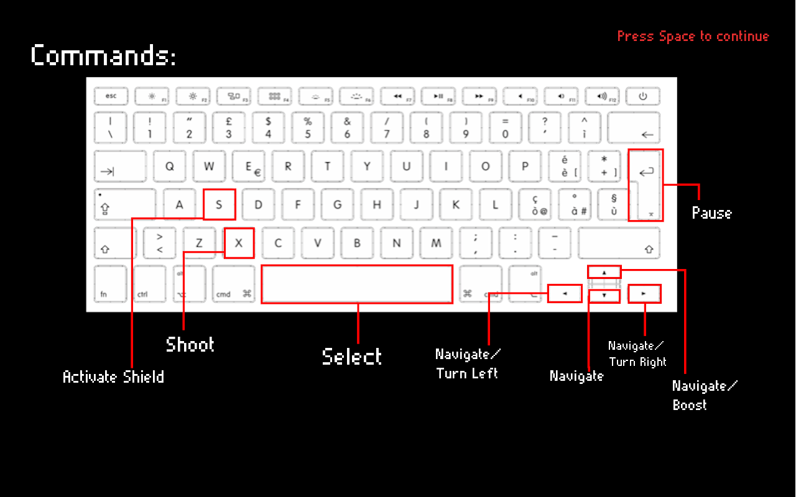
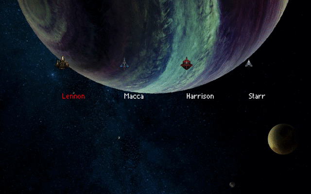
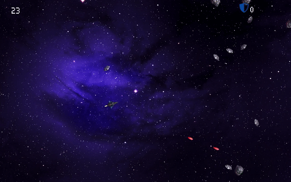
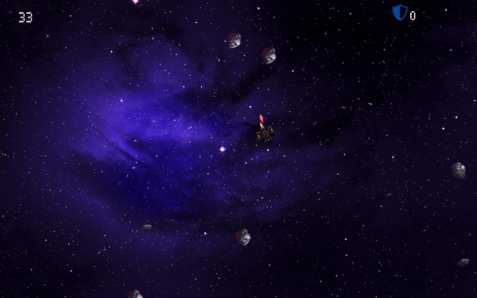
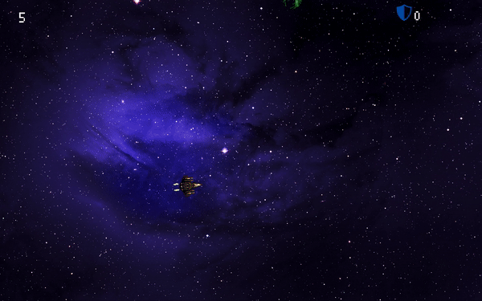

# Xenon Asteroid

This game is a university project intended to be a kind of reboot of the famous [Atari Asteroid](https://www.youtube.com/watch?v=BgloG8yt-jA).

## Getting Started

### Prerequisites
#### Compiler

The game is written in C++, so the first step will be to install a C/C++ compiler.

- Linux users (I'm referring to Ubuntu Linux since it's the most used Linux OS) just have to open a Terminal session (ctrl+T) and run the following line to install gcc (C compiler), g++ (C++ compiler) and the make utility:
```
    sudo apt install build-essential
```
- For Mac Os users the simplest solution is to install Xcode command line developer tools. Again, open the Terminal and launch:
```
    xcode-select --install
```
If you don't have Xcode in your Mac, the Terminal will, of course, ask you to install it. Just do it, and then you will have the compiler Clang in your Mac.

- For Windows user... well, [this guide](https://www.avoiderrors.com/completely-remove-windows-10-and-install-ubuntu/) is for you.
Just kidding, but since I'm not a Windows user myself I will honestly suggest you to follow [this guide](https://www.ics.uci.edu/~pattis/common/handouts/mingweclipse/mingw.html), or in general look for MinGW (gcc and g++ for Windows).
Well you could still decide to follow the first guide  ¯\\-(ツ)-/¯

#### SFML
[SFML](https://www.sfml-dev.org) is the library I used. SFML has one of the kindest community online, they have a Wiki and Forum, both have been helpful.
In order to install SFML, the wisest procedure is to follow [their guide](https://www.sfml-dev.org/tutorials/2.5/).

#### Integrated Development Environment
This is a personal preference, I myself don't use IDEs all the time I have to code.
The best IDEs in my opinion are Xcode (just for Mac, free) and Clion (cross platform but not free).
Check [here](https://hackr.io/blog/cpp-ide) for some C++ compatible IDE for your machine.

    
### Get the code
Some IDEs grant you the possibility to pull the code from a repository source. Check if your IDE can too, and also how to do it.
The link of the project, if you are as lazy as me, its this one:  https://github.com/Lauro98/XenonAsteroids.git

## The Game
### Commands
This is an in game screen, so don't worry, commands will be visible just after the splash screen and everytime the player wants to, from the Settings menu.

### Gameplay

The player will choose one from the four different (both in graphic and statistics) spaceships available.


The player will have to fly in a slice of space while dangerous asteroids will spawn and go across the screen.
Shooting asteroids will give the player some point that are spendable to buy shields that will protect the player when veers are not possible.




Aliens will spawn. They will chase the player waiting to be enough near to shoot and destroy the spaceship.




## Author
*Lauro Rossi*, ([Lauro98](https://github.com/Lauro98)).

## Credits
* Special thanks to Nick Koirala (original version) and [ahnonay](https://github.com/ahnonay) (SFML2 compatibility) for their Collision detection. It helped a lot smoothing the gameplay.
* Thanks to all the SFML community for their work, their Wiki and their forum.
* In game music: Interstellar Main Theme by Hans Zimmer [piano cover](https://www.youtube.com/watch?v=4y33h81phKU), Come Together by The Beatles, Come Together by The Beatles [piano cover](https://www.youtube.com/watch?v=RkyC5QSNOK4).